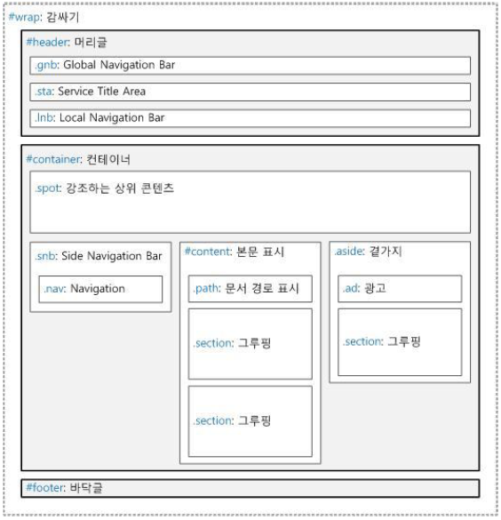
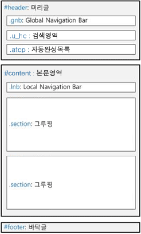

# Naming Guide

##1. 기본규칙

###1-1 공통규칙
* 영문 소문자, 숫자, 언더스코어(_)만 사용할 수 있다.
* 언더스코어(_)가 시작이나 끝에도 넣을 수 없다.
* 언더스코어(_)는 단어와 단어 조합할 때만 사용한다.

```
ex)
	2list_notice   ( x )
	List_notice    ( x )
	List_notice_   ( x )
	_List_notice   ( x )
	list_notice2   ( o )
```

* '형태\_의미_상태' 순서로 조합하며, 3단계를 넘어가지 않도록....

```
ex)
	box_news_list_on   ( x )
	btn_apply_on       ( o )
	btn_on             ( o )
	btn_apply_list_on  ( x )
```

###1-2 id class 규칙
* id는 문서 내 한 번만 사용하며, id, class는 같지 않게 한다.
* 레이아웃을 제외한 id는 스타일을 지정하지 않는다.
* id는 camelcase 방식으로 하며, class는 underscore 방식으로 사용한다.

```
ex) 
	id="boardView" class="link_view"  ( 0 )
	id="board_View" class="link-view"  ( x )
```

##2 레이아웃 약속어

######pc 레이아웃 템플릿


######모바일 레이아웃 템플릿


###2-1 레이아웃 약속어 범위
* 레이아웃에는 다음 표에 예약된 id만 사용한다.

약속어 | 범위
--- | ---
\#wrap | 페이지 전체 영역
\#header | 머리글 영역
\#container | 본문 영역
\#content | 주요 콘텐츠 영역
\#footer | 바닥글 영역

###2-2 팝업 레이아웃 
* 팝업 문서의 레이아웃 지정 범위는 동일하다.
* 레이아웃 약속어 앞에 'pop_'를 조합하여 사용한다.
 
약속어 | 범위
--- | ---
\#pop_wrap | 페이지 전체 영역
\#pop_header | 머리글 영역
\#pop_container | 본문 영역
\#pop_content | 주요 콘텐츠 콘텐츠 콘텐츠 영역


##3. prefix/subfix/suffix 정의
###3-1 후보자
* 접두사를 의미하며, 앞부분에 사용하며, 주로 형태를 나타내는 데 사용된다.

```
ex) 
	tab_notice, tbl_product
```
* 기본 프리픽스는 형태별로 통일한다.
* 서브 프리픽스가 필요한 부분은 underscore로 구분하여 표기한다 (line / line_dot)
* 프리픽스 리스트에 한해 subfix, suffix에서 축약형 네이밍 사용한다 (이외 네이밍은 의미전달 가능하도록 기재)
* prefix 2개 이상 중복 시 기능적인 prefix가 맨 앞부분에 위치할 수 있도록 한다.
* 단독사용 클래스는 지양하며 prefix를 조합한 형태로 작성한다. 예외:fst, lst, hide, on
* on 클래스인 경우, 단일 특정요소에 상태변화 클래스를 적용한다면 suffix로서 적용한다.

###3-2 분류별 Prefix 부가설명

분류 | prefix | 부가설명
--- | --- | ---
타이틀 | title | 일반적인 타이틀
영역	 | section | 제목 태그(Heading Tag)를 지닌 영역 구분 (선택적 사용, 중첩사용 지양)
영역 | inner | 부모 wrapper 가 존재하며 자식 묶음이 단독으로 필요한 경우
내비게이션 | gnb | 	서비스 전체 내비게이션
내비게이션 | lnb | 지역 내비게이션(gnb 영역)
내비게이션 | snb | 사이드 내비게이션(좌측메뉴)
탭 | tab |
테이블 | table |	
목록 | list | 일반 목록(ul, ol, 리스트 형식의 dl)
폼 | form | textfield (input 타입 text / textarea)
폼 | input | input 타입 radio, checkbox, file 등
폼 | select | selectbox
폼 | label | label	
폼 | fieldset | fieldset
버튼 | btn |
박스 | box |
아이콘 | ico |
선 | line_방향 | 일반 실선
선 | line\_dot_방향 | 점선
배경 | bg	
섬네일 이미지 | thumb	
페이징 | paging	
배너 | banner	
텍스트 | txt | 일반 텍스트
텍스트 | txt_bar | 구분선 텍스트
텍스트 | num | num1, num2, ... - 숫자 사용 시 언더바(underscore) 사용 X
텍스트 | copyright	
텍스트 | time | 날짜 및 시간
링크 | link | 일반 링크
링크 | more | 더 보기 링크
순서 | first, middle, last	
팝업 | popup	
레이어 | layer	
광고 | ad	
위젯 | widget_소재명	
상세내용 | desc	
댓글 | cmt	

###3-3 분류별 subfix 부가설명

분류 | subfix | 부가설명
--- | --- | ---
공용 | common | 전역으로만 사용
위치변화 | top/middle/bottom/left/right	
순서변화 | first/last
그림자 | shadow	
화살표 | arr
버튼상태변화 | nor	
방향 | hori/vert	
카테고리 | catergori
순위 | rank


##4. 이미지 네이밍 규칙
###4-1. 이미지 네이밍

* 같은 분류의 이미지가 두 개 이상이면 파일 이름 마지막에 숫자를 추가하여 구분한다.
* 이미지 네이밍은 이미지 확장자와 관계 없이 순차적으로 적용한다. 예) bu_dot1.gif, bu_dot2.jpg, bu_dot3.png
* 임시 이미지는 tmp_를 조합한다. 예) tmp_
* 이미지 이름은 '형태_의미_상태' 순서로 조합한다.

잘못된 예 | 올바른 예 | 설명
--- | --- | ---
on\_recommend\_tab1 | tab1\_recomm\_on | 형태\_의미\_상태 순서로 조합한다.
bnm.gif | btn/_naver/_mail.gif | 임의로 축약하지 않는다.
btn.gif | btn_srch.gif | 영문 소문자를 사용하지 않는다.
1btn_search.gif | btn_srch.gif | 숫자로 시작하지 않는다.


